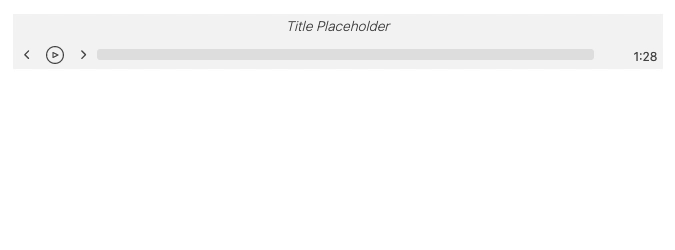
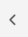
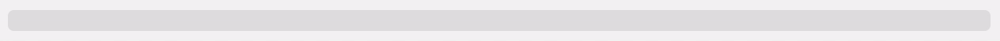

# Creating a custom audio player using the SpeechKit Player SDK
	
SpeechKit offers a [JavaScript Player SDK](https://docs.speechkit.io/player/js-player-and-sdk) that can be used to create custom audio players for your audio projects. 

This repository provides an example built using ReactJS. 

A key feature of creating a custom player is the ability to create extra features, for example, to increase user engagement. 

One way this can be achieved is by displaying the player to the user, but only making it usable to those with a subscription. If they are not subscribed a drop down box entices them to do so.

<p align="center">
  
</p>

## Initial Setup

The SpeechKit Player SDK is the foundation around which the audio player is built. 

The various methods and events it provides can be utilised to develop an audio player with an interface and functionality to meet different demands. 

Install the Player SDK:

```
npm install @speechkit/speechkit-audio-player-v2
```

Setup the React application using your preferred method. The easiest way is to use [Create React App](https://create-react-app.dev/docs/getting-started/).

## Player Setup

### Player Component
Create a component called `Player.js`

Import the `useEffect`, `useRef` and `useState` hooks, as well as the SpeechKit SDK:

```javascript
import React, { useEffect, useRef, useState } from 'react';
import { SpeechKitSdk } from '@speechkit/speechkit-audio-player-v2';
```
Create a Player function, and set it as the default export:

```javascript
function Player() {
 }
 
export default Player;
```

### Player Initialisation Parameters
To initialise the player using the SDK some parameters are required, these can be obtained from your SpeechKit account.

Create an `initParams` object:

```javascript
const initParams = {
  // Mandatory Parameter
  projectId: 'YOUR_PROJECT_ID',
  
  // One of the following parameters
  podcastId: 'YOUR_PODCAST_ID',
  articleUrl: 'YOUR_ARTICLE_URL',
  externalId: 'YOUR_EXTERNAL_ID',
};
```

Your keys and IDs should be stored securely. For simplicity, in this example they are stored in a separate `keys` file:

```javascript
const initParams = {
  projectId: keys.project_id,
  externalId: keys.external_id
};
```


## Page Styling
The player style can be customised however you like. In this example it was kept to a simple shape and neutral colours, and the player dimensions fixed to a specified size. 

Add some page styling to `App.css`:

```css
main {
    width: 100%;
    padding: 2rem 0;
    display: flex;
    flex-direction: column;
    align-items: center;
}
```
Create `Player.css` and `Dropdown.css`

Styles will be added to these files later.

Import them to the `Player` component:

```javascript
import '../Player.css';
import '../Dropdown.css';
```

## State and Refs
Numerous state and reference values are required.

### useState()
There are six state values that are maintained:

1. `playerInstance` - The instance of the player
2.  `playerReady` - Whether the player is ready to play audio
3.  `trackDuration` - The duration of audio
4.  `isPlaying` - Whether audio is playing
5.  `timeDisplays` - The audio clock/timers
6.  `userLoggedIn` - Whether the user is logged in/has a subscription

```javascript
const [playerInstance, setPlayerInstance] = useState(null);
const [playerReady, setPlayerReady] = useState(false);
const [trackDuration, setTrackDuration] = useState(0);
const [isPlaying, setIsPlaying] = useState(false);
const [timeDisplays, setTimeDisplays] = useState({ displayType: 'duration' });
const [userLoggedIn, setUserLoggedIn] = useState(true);
```

### useRef()
Four reference values are required:

1. `progressRef` - The progress bar
2. `filledRef` - The 'filled' part of the progress bar
3. `timerRef` - The audio clock/timer
4. `dropRef` - The login/subscribe dropdown 

```javascript
const progressRef = useRef(null);
const filledRef = useRef(null);
const timerRef = useRef(null);
const dropdownRef = useRef(null);
```

## Player HTML and Styling

### HTML

The player interface is essentially a collection of buttons acting as controls for specific player instance methods. 

At a minimum an audio player will be expected to have a play/pause button and a progress bar. In this example rewind and forward skip buttons are also included as well as clock/timer that the user can click to display different the audio time in different formats. 

The HTML structure for this is as follows:

```html
<div className='player-container'>

  <h4 className='label'>Title Placeholder</h4>

  <div className='controls'>

    <button className='rwd-fwd' name='rwd'></button>

    <button className='play-pause'></button>

    <button className='rwd-fwd' name='fwd'></button>

    <div className='progress' ref={progressRef}>
      <div className='progress-filled' ref={filledRef}></div>
    </div>

    <div className='timer' ref={timerRef}></div>

  </div>

</div>
```

Your `Player` component should now look like this:

```javascript
function Player() {
  const [playerInstance, setPlayerInstance] = useState(null);
  const [playerReady, setPlayerReady] = useState(false);
  const [trackDuration, setTrackDuration] = useState(0);
  const [isPlaying, setIsPlaying] = useState(false);
  const [timeDisplays, setTimeDisplays] = useState({ displayType: 'duration' });
  const [userLoggedIn, setUserLoggedIn] = useState(true);

  const progressRef = useRef(null);
  const filledRef = useRef(null);
  const timerRef = useRef(null);
  const dropdownRef = useRef(null);

  return (
    <>
      <div className='player-container'>

        <h4 className='label'>Title Placeholder</h4>

        <div className='controls'>

          <button className='rwd-fwd' name='rwd'></button>

          <button className='play-pause'></button>

          <button className='rwd-fwd' name='fwd'></button>

          <div className='progress' ref={progressRef}>
            <div className='progress-filled' ref={filledRef}></div>
          </div>

          <div className='timer' ref={timerRef}></div>

        </div>

      </div>
    </>
  );
}
```

### Styling

In `Player.css` add styling for the player container, label, controls and buttons

```css
.player-container {
    display: flex;
    flex-wrap: wrap;
    flex-direction: row;
    width: 650px;
    height: 55px;
    background-color: rgba(59, 59, 59, 0.055);
    color: rgba(59, 59, 59, 0.900);
    font-family: -apple-system;
}
.label {
    width: 100%;
    text-align: center;
    justify-content: center;
    align-items: center;
    margin-bottom: 5px;
    margin-top: 3px;
    font-size: 0.85rem;
    font-weight: 200;
    font-style: italic;
}
.controls {
    display: inline-flex;
    justify-content: center;
    align-items: center;
    width: 100%;
}
button {
    display: flex;
    border: none;
    align-items: center;
    justify-content: center;
    margin: 2px;
    background-color: rgba(59, 59, 59, 0);
}
```

## Login / Subscribe Dropdown Box


The player should only function if the user has a valid subscription and is logged in. If this is not the case a dropdown box is displayed with methods for the user to login or subscribe. 

Add the dropdown box below the player and provide the necessary URL paths to your login or subscription pages:

```html
<div className='dropdown-container' ref={dropdownRef}>

    <h2>Like what you hear?</h2>

    <h3>Subscribe to hear this article and more</h3>

    <button className='signup-btn'>
        <a href='YOUR_PATH'>Subscribe</a>
    </button>

    <p className='signin-or'>or</p>

    <button className='signup-btn'>
        <a href='YOUR_PATH'>Sign In</a>
    </button>

</div>
```

### Styling

This dropdown is hidden from view until the user attempts to play the audio, it will remain hidden if the user is logged in. 

Add styling for the dropdown container to `Dropdown.css` (this styling will render it hidden):

```css
.dropdown-container {
    opacity: 0;
    height: 0;
    overflow: hidden;
    display: flex;
    flex-wrap: wrap;
    flex-direction: row;
    align-items: center;
    justify-content: center;
    margin: 5px;
    width: 650px;
    top: -90px;
    position: relative;
    background-color: rgba(59, 59, 59, 0.055);
    font-family: -apple-system;
    letter-spacing: 0.2px;
    transition: all 1000ms ease-in-out;
}
```
Create an active class to be added when the dropdown is required to display:

```css
.dropdown-active {
    top: 0;
    height: auto;
    opacity: 1;
}
```

Add the rest of the dropdown styling:

```css
h2, h3 {
    text-align: center;
    width: 100%;
    margin: 10px;
}
h2 {
    font-size: 16px;
    font-weight: 600;
}
h3 {
    font-size: 13px;
    font-weight: 400;
}
.signup-btn {
    padding: 5px;
    margin: 10px;
    width: 125px;
    height: 20px;
    background-color: rgba(59, 59, 59, 0.100);
    font-weight: 200;
    font-size: 13px;
    letter-spacing: 0.2px;
    font-family: -apple-system;
    cursor: pointer;
}
.signin-or {
    text-align: center;
    width: 100%;
    font-size: 12px;
    margin: 0;
}
a {
    text-decoration: inherit;
    color: inherit;
    cursor: auto;
}
```

## Initialising the Player with `useEffect()` Hook

Several `useEffect` hooks are required for updating the component when certain values change and for turning off player event listeners. However, most importantly, a `useEffect` is essential in initialising the player from the SDK. 

### Initialising the Player

When the component first renders the Player component it will asynchronously begin initialisation through the SDK. Once initialised the player instance will be stored in state and become available for use to play audio etc, if this process fails state will be updated accordingly. 

* An async function is used to initialise the player:
	* `playerReady` state is updated with a boolean value
	* An instance of the player is created and stored in state, as well as the track duration
	* The time displays are updated
* This function is called once, when the component first renders

```javascript 
useEffect(() => {
  async function getPlayer() { // Async function
    const isReady = await SpeechKitSdk.isAudioReady(initParams); // Boolean value
    setPlayerReady(isReady); // Update state
    if (isReady) {
      const instance = await SpeechKitSdk.player(initParams); // Creates a player instance
      setPlayerInstance(instance); // Stores instance in state
      setTrackDuration(instance.duration()); // Stores track duration in state
      formatTimeDisplays(); // Updates time displays
    };
  };
  getPlayer(); // Called at first render
}, []);
```

With the player instance ready the controls of the player can be added. 

## Player Controls

### Play and Pause
<p align="center">
  
</p>

Within the HTML add your chosen Play/Pause icons. Conditionally render them depending on the `isPlaying` state. 

Add a `handlePlayPause` `onClick` event handler:

```javascript
<button className='play-pause' onClick={() => handlePlayPause()}>
	{!isPlaying ? <PauseIcon /> : <PlayIcon />}
</button>
```

Create a `handlePlayPause` function.

This function needs to two conditionals:

* Is user logged in, display dropdown and make audio unavailable if not
* Play or pause audio depending on current `isPlaying` value
    * An event listener is started to provide time / progress tracking functionality

```javascript
const handlePlayPause = () => {
    if (!userLoggedIn) {
        dropdownRef.current.classList.add('dropdown-active'); // Displays dropdown if user is not logged in
        return; // Stops any further execution
    } else {
        dropdownRef.current.classList.remove('dropdown-active');
    };

    if (!isPlaying && userLoggedIn) {
        // Starts play 
        playerInstance.play();
        setIsPlaying(true);
        playerInstance.events.on('timeUpdate', handleEvent);
        playerInstance.events.on('ended', handleEvent);
    } else {
        // Pauses play   
        setIsPlaying(false);
        playerInstance.pause();
    };
};
```

##### Handling the `timeUpdate` and `ended` events

When audio starts playing two event listeners are created.

* `timeUpdate` - Fires at 250ms intervals, so can be used to provide time tracking functionality
* `ended` - Used to reset the player back to the start once audio has finished

External to `handlePlayPause` create a `handleEvent` function:

```javascript
const handleEvent = () => {};
```

N.B. The `timeUpdate` listener must be turned off before the component unmounts, otherwise multiple handlers will run simultaneously after each re-mounting. 

Create a `useEffect` hook to turn off the `timeUpdate` event listener when the component unmounts:

```javascript
useEffect(() => {
    if (playerInstance) { // Check required to avoid error if playerInstance is null or undefined
        return () => {
            playerInstance.events.off('timeUpdate', handleEvent)
        };
    };
}, [isPlaying]);
```

Whenever an event is fired a `dataEvent` object will be passed to the event handler.

As there are two events being handled the objects for each will be different. By measuring their length they can be distinguished between. 

When audio has finished playing and has ended, playback can be reset to the start. Add this functionality to `handleEvent`:

```javascript
const handleEvent = (dataEvent) => {
    if (Object.keys(dataEvent).length === 1) { // 'ended' data event has a length of 1, 'timeUpdate' has a length of 3
        setIsPlaying(false)
        playerInstance.changeCurrentTime(0);
        playerInstance.pause();
    };
};
```

##### Styling

In `Player.css`:

```css
.play-pause {
    color: rgba(59, 59, 59, 0.900);
    cursor: pointer;
}
```

### Skip 

<p align="center">
  
  &nbsp;&nbsp;&nbsp;
  &nbsp;&nbsp;&nbsp;
  &nbsp;&nbsp;&nbsp;
  
</p>

Add your chosen skip icons.

Add a `handleSkip` `onClick` event handler:


```html
<button className='rwd-fwd' name='rwd'>
    <RwdIcon onClick={(e) => handleSkip(e)} />
</button>

<button className='rwd-fwd' name='fwd'>
    <FwdIcon onClick={(e) => handleSkip(e)} />
</button>
```

Create a `handleSkip` function:

```javascript
const handleSkip = (e) => {
    const { name } = e.target.parentNode;
    const skipValue = 5.00;
    if (name === 'rwd') {
        playerInstance.rewind(skipValue);
    };
    if (name === 'fwd') {
        playerInstance.forward(skipValue);
    };
    formatTimeDisplays();
};
```

##### Styling

In `Player.css`:

```css
.rwd-fwd {
    padding: 0;
}
.rwd-fwd-svg {
    color: rgba(59, 59, 59, 0.900);
    cursor: pointer;
    padding: 3px;
    margin: 2px;
}
```

### Time Display

<p align="center">
  
</p>

Multiple time display formats are able to be cycled through by clicking the timer. 

Create a `formatTimeDisplays` function to format the time displays and store them to state:

```javascript
const formatTimeDisplays = () => {
    const currentTime = playerInstance === null ? 0 : playerInstance.currentTime();

	// Format duration: 0:00
    const minsDuration = Math.round(trackDuration / 60);
    const secsDuration = Math.round(trackDuration % 60);
    const durationFormat = `${minsDuration}:${secsDuration < 10 ? '0' : ''}${secsDuration}`;
	
	// Format timer to count up from zero: 0:00+
    const mins = Math.round(currentTime / 60);
    const secs = Math.round(currentTime % 60);
    const upFormat = `${mins}:${secs < 10 ? 0 : ''}${secs}`;
	
	// Format timer to count down from track duration: -0:00
    const subMins = Math.round((trackDuration - currentTime) / 60);
    const subSecs = Math.round((trackDuration - currentTime) % 60);
    const subFormat = `-${subMins}:${subSecs < 10 ? 0 : ''}${subSecs}`;
	
	// Count up or down next to duration: 0:00/0:00
    const dualUp = `${upFormat}/${durationFormat}`;
    const dualSub = `${subFormat}/${durationFormat}`;
    
    // Store all in state
    setTimeDisplays(prevDisplay => ({ ...prevDisplay, durationFormat, upFormat, dualUp, subFormat, dualSub }));
};
```

Create a `displayTimer` function that displays the selected time format:

```javascript
const displayTimer = () => {
    if (trackDuration <= 0) return; // Does not display time if there is no track duration i.e. the audio hasn't loaded
    switch (timeDisplays.displayType) {
        case 'duration':
            return timerRef.current.innerText = timeDisplays.durationFormat;
        case 'upFormat':
            return timerRef.current.innerText = timeDisplays.upFormat;
        case 'dualUp':
            return timerRef.current.innerText = timeDisplays.dualUp;
        case 'subFormat':
            return timerRef.current.innerText = timeDisplays.subFormat;
        case 'dualSub':
            return timerRef.current.innerText = timeDisplays.dualSub;
        default:
            return timeDisplays.durationFormat;
    };
};
```

Add a `handleTimeClick` `onClick` event handler:

```html
<div className='timer' ref={timerRef} onClick={() => handleTimeClick()}></div>
```

Create a `handleTimeClick` function that cycles through the various formats based on the currently displayed format:

```javascript
const handleTimeClick = () => {
    switch (timeDisplays.displayType) {
        case 'duration':
            setTimeDisplays(prevDisplay => ({ ...prevDisplay, displayType: 'upFormat' }));
            break;
        case 'upFormat':
            setTimeDisplays(prevDisplay => ({ ...prevDisplay, displayType: 'dualUp' }));
            break;
        case 'dualUp':
            setTimeDisplays(prevDisplay => ({ ...prevDisplay, displayType: 'subFormat' }));
            break;
        case 'subFormat':
            setTimeDisplays(prevDisplay => ({ ...prevDisplay, displayType: 'dualSub' }));
            break;
        case 'dualSub':
            setTimeDisplays(prevDisplay => ({ ...prevDisplay, displayType: 'duration' }));
            break;
        default:
            setTimeDisplays(prevDisplay => ({ ...prevDisplay, displayType: 'duration' }));
            break;
    };
};
```

##### Displaying time on initial audio load

To display a timer when audio is first loaded (rather than 0:00) two `useEffect` hooks are needed.

 * First to call `formatTimeDisplays()` once a track duration has been stored: 

```javascript
useEffect(() => {
    formatTimeDisplays();
}, [trackDuration]);
```

* The second tracks any changes in `timeDisplays` and keeps the clock/timers updated by calling `displayTimer()`:

```javascript
useEffect(() => {
    displayTimer();
}, [timeDisplays]);
```

##### Keeping the timer display updated

Call `formatTimeDisplays()` in the `handleEvent()` function so that `timeDisplays` is continuously updated:

```javascript
const handleEvent = () => {
    formatTimeDisplays()
};
```
##### Styling

In `Player.css`:

```css
.timer-container {
    margin: 2px;
}
.timer {
    height: 11px;
    text-align: right;
    min-width: 9%;
    margin: 5px;
    cursor: pointer;
    font-size: 0.75rem;
}
```

### Progress Bar

<p align="center">
  
</p>

The progress bar is made up of a container with an internal 'filled' part that tracks the progress of the audio. 

The user can click on the progress bar to change the audio playback position. 

Create a `handleProgress` function to update the filled part of the progress bar as the audio progresses:

```javascript
const handleProgress = () => {
    const currentTime = playerInstance.currentTime();
    const percent = (currentTime / trackDuration) * 100;
    filledRef.current.style.width = `${percent}%`; // Width of filled part is updated
};
```

##### Keeping the progress bar updated

Call `handleProgress()` in `handleEvent()` to keep the progress bar continuously updated:

```javascript
const handleEvent = () => {
    handleProgress();
    formatTimeDisplays();
};
```

Add a `progressClick` `onClick` event handler:

```html
<div className='progress' ref={progressRef} onClick={(e) => progressClick(e)}>
    <div className='progress-filled' ref={filledRef} ></div>
</div>
```

Create a `progressClick` function that updates the playback position to match the user's click. 

The click position can be calculated using the coordinates of progress bar relative to the rest of the page.

```javascript
const progressClick = (e) => {
    const { width, left } = progressRef.current.getBoundingClientRect(); // Progress bar coordinates
    const x = e.nativeEvent.clientX - left; // Position of click relative to progress bar
    const percent = (x / width) * 100 // Percentage of progress bar to fill
    const time = Number(((trackDuration / 100) * percent).toFixed(2)); // New time to start playback from 
    
    filledRef.current.style.width = `${percent}%`; // Update filled width
    playerInstance.changeCurrentTime(time); // Update playback position
};
```

##### Styling

In `Player.css`:

```css
.progress {
    width: 100%;
    display: flex;
    height: 11px;
    background: rgba(59, 59, 59, 0.100);
    cursor: pointer;
    border-radius: 3px;
}
.progress-filled {
    width: 0;
    background-color: rgba(59, 59, 59, 0.5);
    margin: 3px;
}
```

## Summary

The player is now complete and should operate fully. 

This guide provides the basic functionality for a player to be usable, and examples of how this functionality can be expanded upon to create additional features. 

It did not include all of the methods available from the SpeechKit SDK, so it is worth reading through the [documentation](https://docs.speechkit.io/player/js-player-and-sdk) to see what other functionality can provide the features you require.
